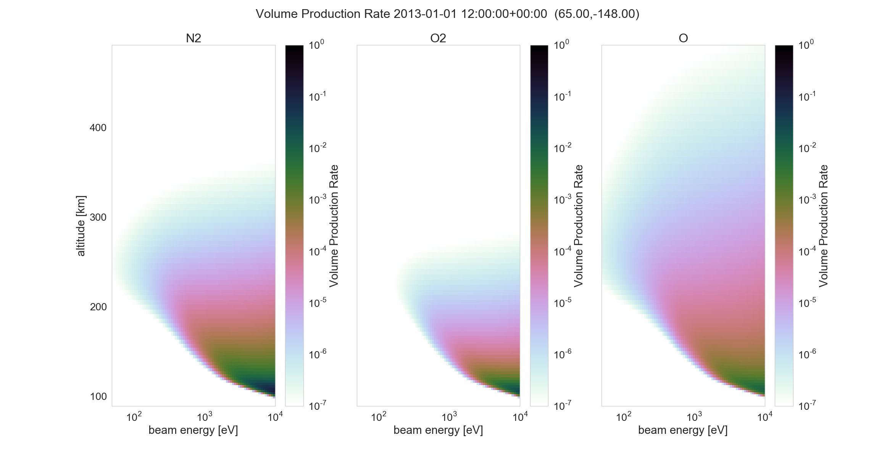

.. image:: https://travis-ci.org/scienceopen/reesaurora.svg
    :target: https://travis-ci.org/scienceopen/reesaurora

.. image:: https://coveralls.io/repos/scienceopen/reesaurora/badge.svg?branch=master&service=github 
    :target: https://coveralls.io/github/scienceopen/reesaurora?branch=master

.. image:: https://codeclimate.com/github/scienceopen/reesaurora/badges/gpa.svg
   :target: https://codeclimate.com/github/scienceopen/reesaurora
   :alt: Code Climate    
==========
ReesAurora
==========

Rees-Sergienko-Ivanov module of excitation rates, relevant to auroral optical emissions
inspired/based upon Gustavsson / Brandstrom et al `AIDA_Tools <https://github.com/scienceopen/AIDA-tools>`_

Uses MSISE-00 to generate O, O\ :sub:`2`, N\ :sub:`2` densities, and models outcome of primary electron precipitation on this neutral background. Validity at high energies unverified.

.. contents::

Installation
============
::

  git clone --depth 1 https://github.com/scienceopen/reesaurora
  conda install --file requirements.txt
  python setup.py develop

Example
==================
::

  python RunRees.py 2011-03-15T12:34:56Z -c 65 -148

-o    specify output file (HDF5)
-c    specify geographic lat,lon
